# КПК Зоны — руководство пользователя

Мобильное Android-приложение в стиле КПК из S.T.A.L.K.E.R. Оно работает автономно: карта, задания, заметки, GPS-привязка и QR-обмен, включая передачу самой привязки карты, хранятся на телефоне. Интернет для обычной работы не требуется.

> **Примечание к иллюстрациям:** во всех скриншотах используется полностью условная демонстрационная карта. Реальная игровая карта в GitHub-пакет и документацию не включена.

Готовый APK находится здесь:

```text
apk/stalker-pda-v1.0.6-release.apk
```

Ручная веб-версия находится в папке `web/`. Для GPS и камеры запускайте её через локальный сервер и открывайте именно `http://localhost:8080/`. Краткая инструкция: [`web/README_LOCALHOST.md`](web/README_LOCALHOST.md).

Полный однофайловый HTML также приложен отдельно: `stalker-pda-web-v1.0.6.html`.

> При обновлении устанавливайте новую версию **поверх старой**. Не удаляйте приложение заранее, если хотите сохранить локальную карту, метки и заметки.

---

## Содержание

1. [Первый запуск](#1-первый-запуск)
2. [Главный экран и верхняя панель](#2-главный-экран-и-верхняя-панель)
3. [Загрузка и замена карты](#3-загрузка-и-замена-карты)
4. [Перемещение и масштабирование карты](#4-перемещение-и-масштабирование-карты)
5. [Создание метки](#5-создание-метки)
6. [Просмотр и редактирование метки](#6-просмотр-и-редактирование-метки)
7. [Раздел «Задания»](#7-раздел-задания)
8. [Раздел «Заметки»](#8-раздел-заметки)
9. [GPS и двухточечная привязка](#9-gps-и-двухточечная-привязка)
10. [Передача через QR-код](#10-передача-через-qr-код)
11. [Получение через камеру или изображение](#11-получение-через-камеру-или-изображение)
12. [Резервная копия и восстановление](#12-резервная-копия-и-восстановление)
13. [Удаление карты и полный сброс](#13-удаление-карты-и-полный-сброс)
14. [Звук, полноэкранный режим и кнопка «Назад»](#14-звук-полноэкранный-режим-и-кнопка-назад)
15. [Практические советы и устранение проблем](#15-практические-советы-и-устранение-проблем)

---

## 1. Первый запуск

После запуска появляется экран инициализации. Нажмите **«Включить КПК»**.

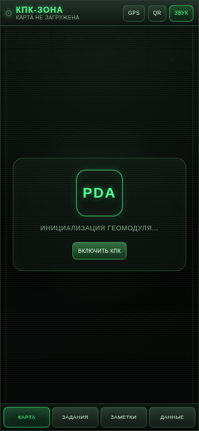

После включения приложение открывает вкладку **«Карта»**. Стартовых заданий нет: список изначально пустой.

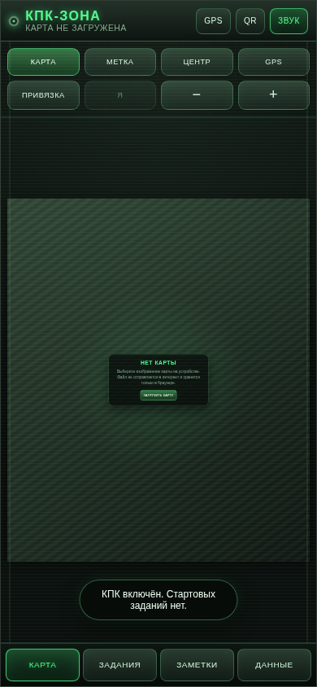

Что происходит при первом включении:

- создаётся локальное хранилище приложения;
- загружаются ранее сохранённые задания и заметки, если они есть;
- восстанавливается сохранённая карта;
- GPS и камера не включаются сами — разрешения запрашиваются только после нажатия соответствующей кнопки.

---

## 2. Главный экран и верхняя панель

Вверху находятся постоянные кнопки:

| Кнопка | Назначение |
|---|---|
| **GPS** | Включает или выключает отслеживание текущего положения. При первом использовании Android попросит разрешение на геолокацию. |
| **QR** | Открывает экран получения метки, заметки или GPS-привязки карты через камеру либо изображение QR-кода. |
| **Звук** | Включает и выключает звуки интерфейса. Подсвеченная кнопка означает, что звук включён. |
| **Карта / название файла** | Показывает, загружена ли карта и как называется выбранное изображение. |

Внизу расположены четыре основных раздела:

- **Карта** — навигация, масштаб, метки и GPS-точка;
- **Задания** — список всех меток с фильтрами и действиями;
- **Заметки** — личный журнал;
- **Данные** — GPS-привязка, передача привязки через QR, QR-получение, резервная копия и сброс.

Активная кнопка или вкладка подсвечивается ярко-зелёным цветом.

Длинная постоянная подсказка над картой убрана, чтобы она не обрезалась на узких экранах. Строка появляется только временно в режимах постановки метки, GPS-привязки или при важной ошибке.

---

## 3. Загрузка и замена карты

Карту можно выбрать тремя равнозначными способами:

1. нажать **«Карта»** в панели над изображением;
2. нажать **«Загрузить карту»** в пустой области;
3. открыть **«Данные» → «Карта» → «Выбрать карту»**.

После выбора изображения приложение определяет его реальные размеры, автоматически вписывает в рабочую область и рассчитывает новые границы перемещения.

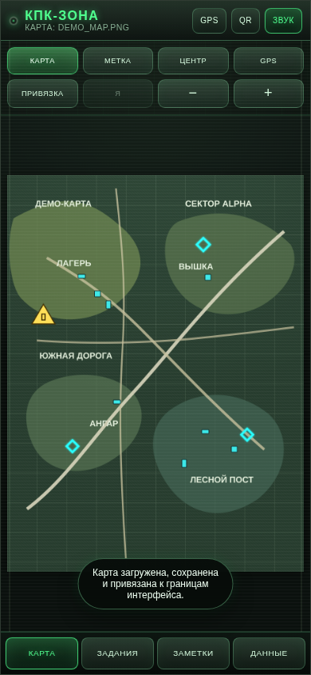

Поддерживаются основные форматы изображений:

- JPG/JPEG;
- PNG;
- WebP;
- GIF;
- BMP;
- AVIF, если формат поддерживается системным WebView телефона.

Ограничения для стабильной работы:

- размер файла — до 45 МБ;
- сторона изображения — до 12 000 пикселей;
- общая площадь — до 64 мегапикселей;
- SVG намеренно не принимается.

### Важно при замене карты

Ограничения движения пересчитываются **каждый раз для новой картинки**. Выйти за её края нельзя.

Существующие метки хранятся в относительных координатах карты. Если заменить изображение на совершенно другую карту, старые метки останутся на тех же относительных местах. Перед такой заменой рекомендуется сделать экспорт резервной копии или удалить ненужные метки.

---

## 4. Перемещение и масштабирование карты

Панель управления картой содержит следующие кнопки:

| Кнопка | Что делает |
|---|---|
| **Карта** | Открывает системный выбор изображения. |
| **Метка** | Включает режим постановки новой метки. После включения коснитесь нужного места на карте. |
| **Центр** | Возвращает карту к начальному масштабу и размещает её по центру экрана. |
| **GPS** | Включает или выключает получение координат. |
| **Привязка** | Запускает последовательную привязку точек A и B. |
| **Я** | Один раз перемещает карту так, чтобы текущая GPS-точка оказалась в центре. Постоянное автоматическое слежение не включается. |
| **−** | Уменьшает масштаб, но не меньше размера, при котором карта закрывает доступную область. |
| **+** | Увеличивает масштаб. |

Жесты:

- **один палец** — перетаскивание;
- **два пальца** — увеличение и уменьшение;
- быстрое движение можно продолжать сразу после нажатия **«Я»**: карта не будет прыгать обратно к GPS-точке;
- при любом масштабе края изображения жёстко ограничивают перемещение.

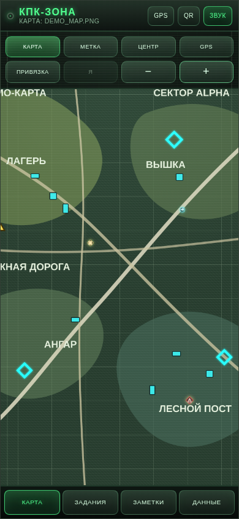

Если при сильном увеличении вы дотянули изображение до края, дальнейшее движение в сторону пустого пространства блокируется. После загрузки другой карты ограничения рассчитываются заново.

---

## 5. Создание метки

1. Откройте вкладку **«Карта»**.
2. Нажмите **«Метка»**. Кнопка подсветится.
3. Коснитесь нужного места на карте.
4. Заполните форму.

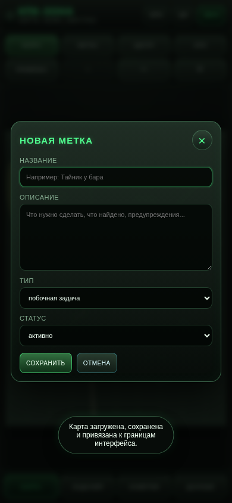

Поля формы:

- **Название** — короткое понятное имя объекта;
- **Описание** — маршрут, предупреждение, условия задания или найденная информация;
- **Тип** — определяет значок и категорию;
- **Статус** — «активно» или «выполнено».

Доступные типы:

- сюжетная задача;
- побочная задача;
- аномалия;
- тайник;
- переход;
- торговец;
- группировка;
- опасность;
- лаборатория;
- заметка на карте.

Нажмите **«Сохранить»**. Метка появится на карте и в разделе «Задания».

Чтобы выйти из режима постановки без создания новой точки, повторно нажмите **«Метка»** или переключитесь на другую вкладку.

---

## 6. Просмотр и редактирование метки

Коснитесь значка на карте. Снизу откроется карточка с названием, описанием, типом, статусом и координатами.

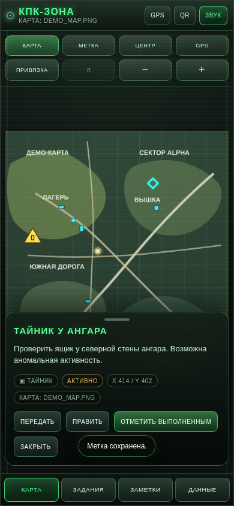

Действия в карточке:

| Действие | Результат |
|---|---|
| **Передать** | Создаёт QR-код этой метки. |
| **Править** | Открывает форму изменения названия, описания, типа и статуса. |
| **Отметить выполненным / Активно** | Быстро меняет состояние задания. |
| **Закрыть** | Скрывает нижнюю карточку. |
| **Удалить** | Удаляет объект после подтверждения. |

За маленькую горизонтальную ручку сверху карточку можно свернуть или развернуть.

На карте одновременно могут отображаться разные значки. При отдалении они автоматически уменьшаются и не занимают чрезмерно много места.

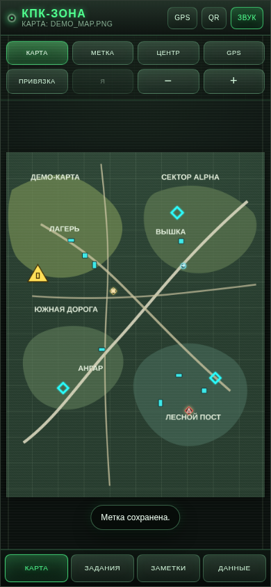

---

## 7. Раздел «Задания»

Здесь собраны все метки карты в виде карточек.

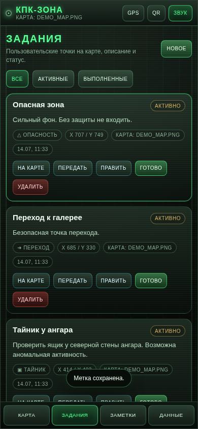

Фильтры:

- **Все** — показывает все объекты;
- **Активные** — только незавершённые;
- **Выполненные** — только завершённые.

Кнопки карточки:

| Кнопка | Назначение |
|---|---|
| **На карте** | Переходит к карте и показывает выбранную точку. |
| **Передать** | Создаёт QR-код для передачи другому устройству. |
| **Править** | Открывает редактор метки. |
| **Готово / Активно** | Переключает статус. |
| **Удалить** | Удаляет метку после подтверждения. |

Кнопка **«Новое»** создаёт новую метку. Если карта загружена и открыта, приложение предложит выбрать точку на ней.

---

## 8. Раздел «Заметки»

Заметки не обязаны быть привязаны к точке на карте. Они подходят для паролей, наблюдений, маршрутов, списков предметов и другой информации.

1. Откройте **«Заметки»**.
2. Нажмите **«Новая»**.
3. Введите заголовок и текст.
4. Нажмите **«Сохранить»**.

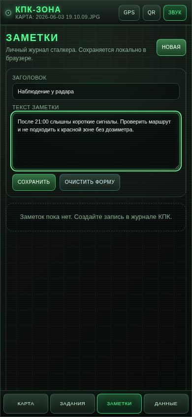

После сохранения запись появляется в списке.

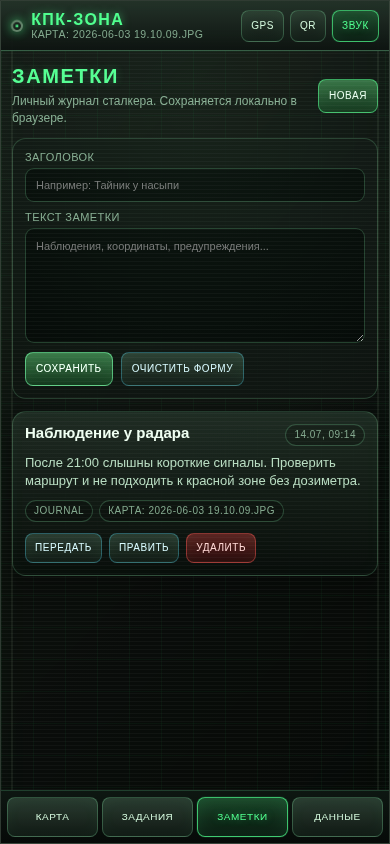

Действия с заметкой:

- **Передать** — показать QR-код заметки;
- **Править** — загрузить запись в редактор;
- **Удалить** — удалить после подтверждения;
- **Очистить форму** — очистить поля редактора, не удаляя уже сохранённые записи.

Заметки и задания сохраняются автоматически в приватной памяти приложения.

---

## 9. GPS и двухточечная привязка

GPS показывает ваше реальное движение на обычной картинке. Для этого необходимо один раз сопоставить реальные координаты с изображением.

Откройте **«Данные»** и найдите блок **«GPS-навигация»**.

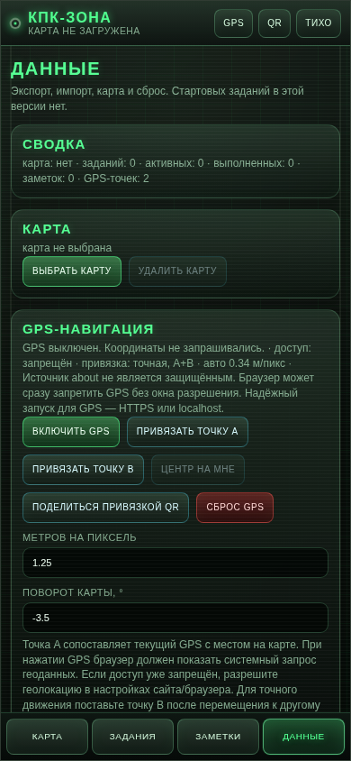

### Подготовка

- включите геолокацию в настройках Android;
- выйдите на открытое место;
- дождитесь устойчивых координат;
- выбирайте на карте места, которые можно точно определить в реальности: перекрёсток, угол здания, поворот дороги, мост или другой заметный объект.

### Привязка точки A

1. Встаньте в известном месте.
2. Нажмите **«Включить GPS»** или кнопку GPS сверху.
3. Разрешите приложению точную геолокацию.
4. Нажмите **«Привязать точку A»** либо общую кнопку **«Привязка»**.
5. Коснитесь на карте места, где вы сейчас стоите.

Точка A задаёт исходное соответствие между GPS и изображением.

### Привязка точки B

1. Переместитесь к другому известному месту. Желательно пройти не несколько метров, а заметное расстояние — например 30–100 метров или больше.
2. Дождитесь обновления GPS.
3. Нажмите **«Привязать точку B»**.
4. Коснитесь соответствующего места на карте.

По двум точкам приложение вычислит:

- масштаб изображения в метрах на пиксель;
- направление движения;
- поворот карты относительно севера.

После завершения метки A и B показываются короткое время, а затем исчезают. Они не засоряют карту, но вычисленная привязка сохраняется.

### Передача готовой GPS-привязки через QR

После создания хотя бы точки A в блоке **«GPS-навигация»** становится активной кнопка **«Поделиться привязкой QR»**.


Кнопка передаёт **только параметры привязки карты**:

- координаты точек A и B, если они созданы;
- положение этих точек на изображении;
- рассчитанный масштаб в метрах на пиксель;
- поворот карты;
- название и размеры изображения для проверки совместимости.

Сам файл карты, задания, заметки и текущее живое положение телефона в QR-код не включаются.

1. На телефоне-источнике откройте **«Данные» → «GPS-навигация»**.
2. Убедитесь, что точка A или точки A/B уже сохранены.
3. Нажмите **«Поделиться привязкой QR»**.
4. На другом телефоне откройте **QR → «Получить через QR»** и отсканируйте код.
5. Проверьте название карты, количество точек и размеры изображения.
6. Нажмите **«Применить привязку»**.

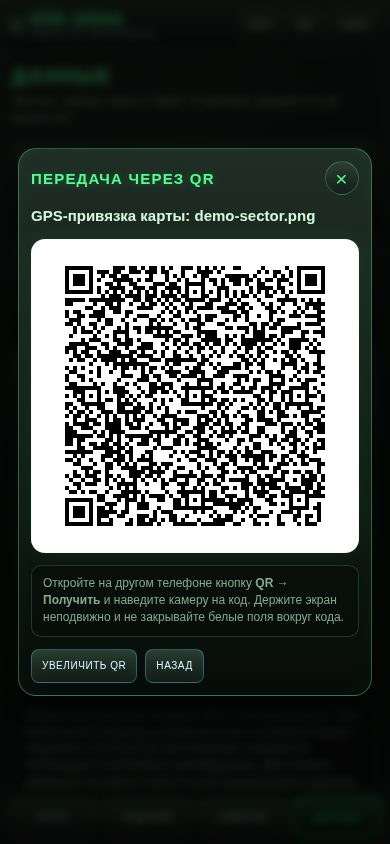

Если на принимающем телефоне загружена карта с другим именем или разрешением, приложение показывает предупреждение. Для наиболее точной работы используйте на обоих устройствах один и тот же файл изображения. При двухточечной привязке A/B перенос устойчивее к различиям масштаба, но одинаковое разрешение карты всё равно рекомендуется.

### Кнопка «Я» / «Центр на мне»

Кнопка один раз ставит текущую GPS-точку в центр экрана. После этого карту можно свободно двигать — автоматическая центровка не включается и не вызывает прыжки.

### Поля «Метров на пиксель» и «Поворот карты»

Это дополнительные ручные настройки:

- **Метров на пиксель** — реальный масштаб изображения;
- **Поворот карты, °** — угол карты относительно направления на север.

При нормальной двухточечной привязке значения рассчитываются автоматически. Вручную их следует менять только при понимании масштаба и ориентации изображения.

### Сброс GPS

Кнопка **«Сброс GPS»** удаляет точки калибровки и рассчитанные параметры, но не удаляет задания и заметки.

### От чего зависит точность

- качества GPS-модуля телефона;
- открытости неба;
- расстояния между A и B;
- точности касания карты;
- соответствия игровой карты реальной местности;
- локальных искажений исходного изображения.

---

## 10. Передача через QR-код

Передавать можно отдельную метку, заметку или готовую GPS-привязку карты. В QR никогда не включается сам файл карты.

Для метки или заметки нажмите **«Передать»**. Для привязки откройте **«Данные» → «GPS-навигация» → «Поделиться привязкой QR»**.

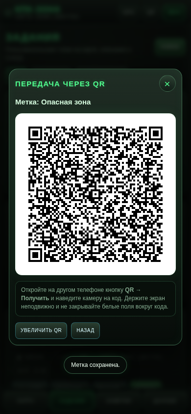

На экране показываются:

- название передаваемого объекта;
- крупный контрастный QR-код;
- краткая инструкция;
- **«Увеличить QR»** — делает код крупнее;
- **«Назад»** или крестик — закрывает окно.

Для хорошего сканирования:

- увеличьте яркость экрана;
- не закрывайте код пальцами;
- держите второй телефон примерно в 15–40 см;
- избегайте сильных бликов;
- при длинном описании QR получается плотнее — при ошибке сократите текст.

Для метки или заметки передаются только данные выбранного объекта: название, описание, тип, статус, координаты и название карты. Для GPS-привязки передаются только контрольные точки и параметры калибровки.

---

## 11. Получение через камеру или изображение

Нажмите кнопку **QR** сверху или откройте **«Данные» → «Получить через QR»**.

### Сканирование камерой

1. Нажмите **«Запустить камеру»**.
2. При первом запуске разрешите доступ к камере.
3. Наведите заднюю камеру на код.
4. Держите QR внутри светящейся рамки.

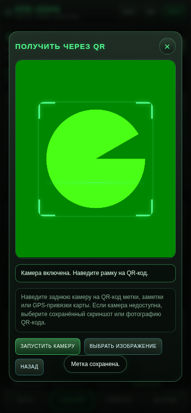

Когда код распознан, камера останавливается и появляется предварительный просмотр.

### Импорт из изображения

Если код прислали скриншотом или камера недоступна:

1. нажмите **«Выбрать изображение»**;
2. выберите фотографию или скриншот QR-кода;
3. дождитесь распознавания.

### Предварительный просмотр

До подтверждения приложение показывает тип данных. Для метки или заметки отображаются название, описание, категория, координаты, статус и карта источника. Для GPS-привязки показываются карта, точки A/B, масштаб, поворот и разрешение исходного изображения.

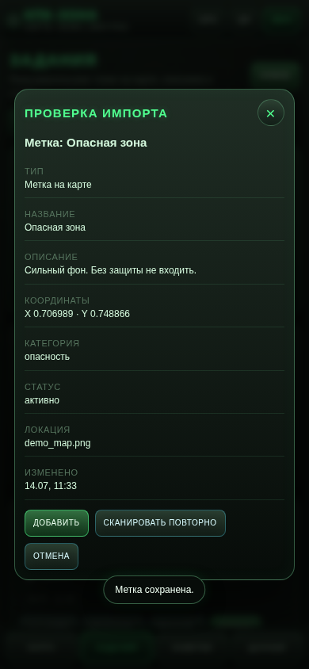

Действия:

- **Добавить** — сохранить метку или заметку;
- **Применить привязку** — заменить текущую GPS-привязку данными из QR-кода;
- **Сканировать повторно** — вернуться к сканеру;
- **Отмена** — закрыть окно без изменений.

Импорт никогда не выполняется автоматически. Если название или разрешение карты отправителя отличается от вашей карты, приложение показывает предупреждение. Проверьте данные перед добавлением объекта или применением привязки.

Камера освобождается сразу после закрытия сканера, распознавания кода или сворачивания приложения.

---

## 12. Резервная копия и восстановление

Откройте **«Данные»** и прокрутите вниз.

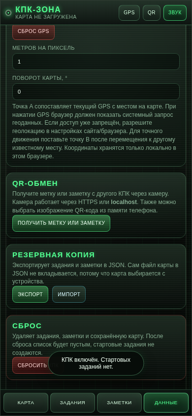

### Экспорт

Кнопка **«Экспорт»** создаёт JSON-файл, содержащий:

- все задания и метки;
- все заметки;
- GPS-привязку;
- служебные данные карты: имя и размеры.

Само изображение карты в резервную копию не входит. Храните исходный JPG/PNG отдельно.

После нажатия Android предложит выбрать папку и имя файла.

### Импорт

1. Нажмите **«Импорт»**.
2. Выберите ранее сохранённый JSON.
3. Подтвердите замену данных.
4. При необходимости снова выберите файл карты.

Импорт заменяет текущие задания и заметки. GPS-привязка заменяется только если она присутствует в файле.

### Рекомендуемый порядок перед обновлением или переносом

1. Экспортируйте JSON.
2. Сохраните исходное изображение карты.
3. Установите обновление поверх старой версии.
4. Если приложение было удалено, загрузите карту и импортируйте JSON.

---

## 13. Удаление карты и полный сброс

### «Удалить карту»

Удаляет только сохранённое изображение и GPS-привязку. Задания и заметки остаются. Это удобно, если нужно заменить карту без потери журнала.

### «Сбросить КПК»

Удаляет:

- задания;
- заметки;
- карту;
- GPS-привязку;
- пользовательские настройки приложения.

После сброса стартовые задания не создаются. Операция требует подтверждения и не отменяется. Перед сбросом сделайте экспорт.

---

## 14. Звук, полноэкранный режим и кнопка «Назад»

### Звук

Кнопка **«Звук»** в верхней панели переключает звуковые сигналы интерфейса. Настройка сохраняется.

### Полноэкранный режим

Приложение скрывает строку состояния Android, часы, сеть, уведомления и нижнюю навигационную панель. Это освобождает экран для карты.

Системным жестом от верхнего или нижнего края можно временно показать панели Android. После возвращения в приложение полноэкранный режим восстанавливается.

### Системная кнопка «Назад»

Приоритет действий:

1. закрывается открытое модальное окно;
2. закрывается карточка метки;
3. отменяется активный режим;
4. затем приложение просит повторно нажать «Назад» для выхода.

Это защищает от случайного закрытия КПК во время работы с картой.

---

## 15. Практические советы и устранение проблем

### GPS-точка не появляется

- проверьте, что геолокация Android включена;
- откройте настройки приложения и разрешите точное местоположение;
- выйдите на открытое место;
- выключите и снова включите GPS внутри КПК;
- при необходимости сбросьте привязку и поставьте A/B заново.

### Камера не запускается

- разрешите камеру в настройках Android для «КПК Зоны»;
- закройте другие приложения, которые используют камеру;
- нажмите **«Запустить камеру»** повторно;
- используйте **«Выбрать изображение»** и импортируйте скриншот QR-кода.

### Карта выглядит смещённой

Нажмите **«Центр»**. Приложение заново впишет изображение в доступную область. Границы карты при этом останутся жёсткими.

### Карта не сохраняется

- убедитесь, что на устройстве есть свободное место;
- выберите изображение обычного размера;
- попробуйте JPG или PNG;
- не очищайте данные приложения в настройках Android.

### Метки на новой карте оказались не там

Метки хранятся относительно размеров изображения. Если новая картинка отличается от старой, координаты визуально изменятся. Верните прежнюю карту, удалите старые метки либо восстановите нужную резервную копию.

### QR не распознаётся

- увеличьте QR-код на телефоне отправителя;
- очистите объектив;
- уменьшите блики и дрожание;
- попробуйте скриншот и кнопку **«Выбрать изображение»**;
- сократите слишком длинное описание и создайте код заново.

### После обновления пропали данные

Такое обычно происходит, если старое приложение было удалено, а не обновлено поверх. Загрузите карту заново и импортируйте резервную копию JSON.

---

## Краткий полевой сценарий

1. Запустите КПК и загрузите карту.
2. Включите GPS и разрешите точную геолокацию.
3. Поставьте точку A в первом известном месте.
4. Перейдите ко второму ориентиру и поставьте точку B.
5. Создавайте метки касанием карты.
6. Используйте «Задания» для статусов и фильтров.
7. Записывайте наблюдения в «Заметки».
8. При необходимости передайте другому устройству отдельный объект или готовую GPS-привязку через QR.
9. В конце смены экспортируйте резервную копию.

---

## Приватность

- карта, GPS-привязка, задания и заметки хранятся локально на устройстве;
- приложение не требует интернет-соединения;
- данные не отправляются на внешний сервер;
- камера используется только во время открытого QR-сканера;
- QR-код содержит только выбранную метку, заметку или параметры GPS-привязки;
- QR с привязкой не содержит файл карты и не передаёт текущее живое местоположение;
- приватный ключ подписи APK в этот публичный GitHub-пакет не включён.
